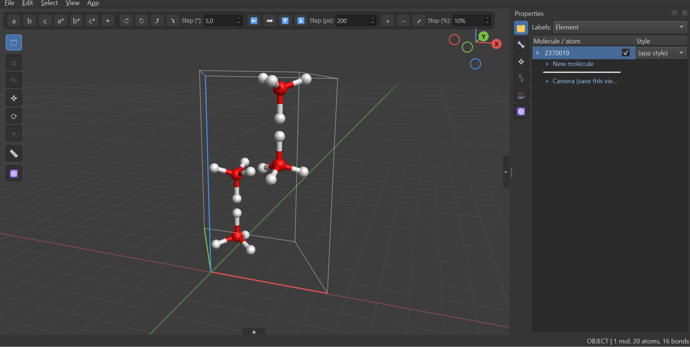
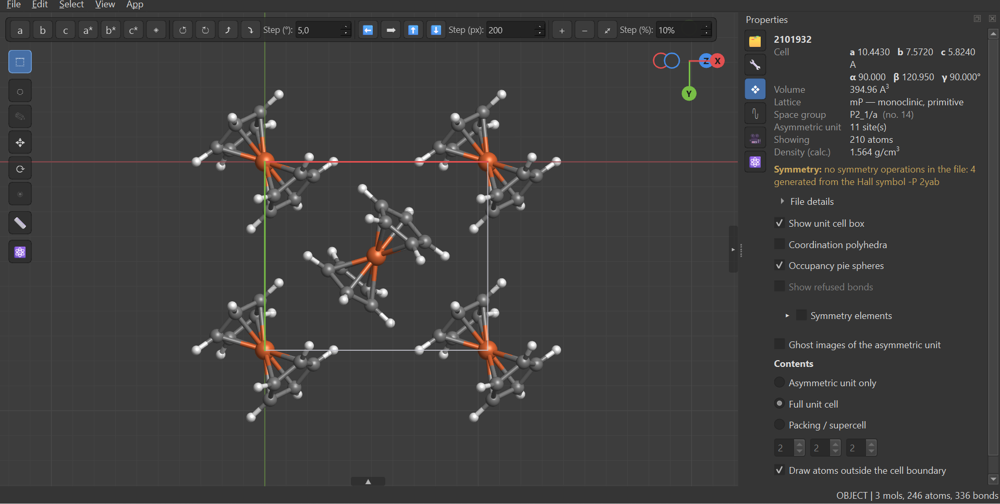

# Screenshots

Hand-picked by Christian, not generated by `tools/screenshots.py` — that tool
still exists and still works (its own default-scene shots are a fine sanity
check after a UI change), but these were composed deliberately to show MoloM
doing more than one thing at once: several structures imported side by side,
two ORCA frequency jobs animating on independent timeline tracks, a camera
frame composed around a whole scene. If you regenerate screenshots for the
README, either keep these filenames pointing at hand-composed shots or update
the README's captions to match whatever the tool produces instead.

### 01-viewport

Cubane (MoloM's default scene) sitting alongside a second structure imported
on top of it — imports **add** to the scene and never replace, so building up
a comparison is one import per structure, not one file per window.

### 02-asymmetric-unit

A CIF drawn as its asymmetric unit only: the handful of crystallographically
distinct fragments the space group expands into the full cell, inside the
unit cell box.

### 03-crystal-packing

The same file's full unit cell — molecules packed and completed across the
cell faces — with the crystal properties page showing what the reader keeps:
cell parameters, volume, calculated density, and the space group re-derived
from the Hall symbol when the file names one without listing its operators.

### 04-camera-view

A saved camera framing three different crystal structures at once — a
coordination compound, a polyhedral framework, and a simple ionic lattice —
composed together in one shot the way a figure for a paper would be.

### 05-vibrations

Two independent ORCA FREQ jobs baked onto the scene clock and playing at once
on their own timeline tracks, with several other imported structures and
molecules sharing the scene around them — the point being that a vibration is
ordinary animation to MoloM, not a special mode that locks out everything
else.
