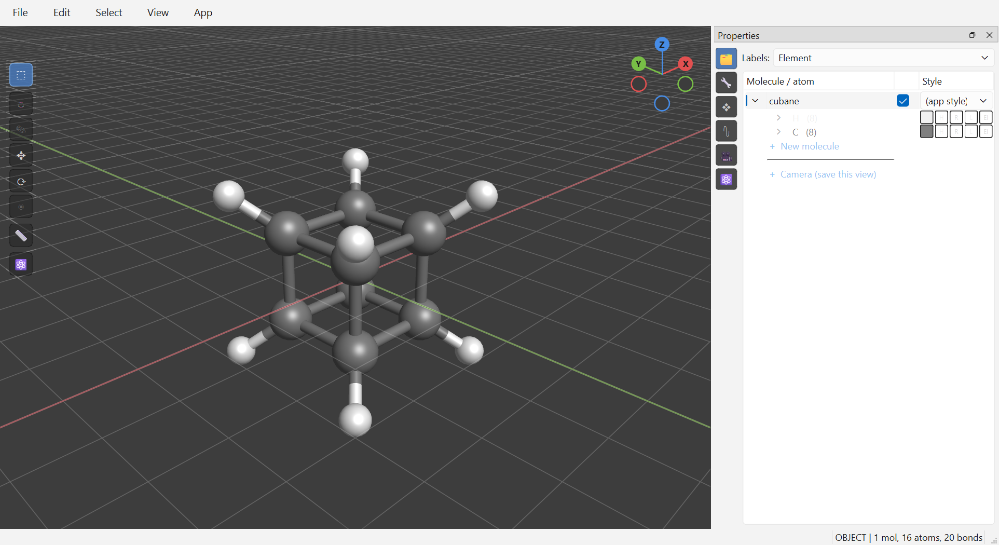
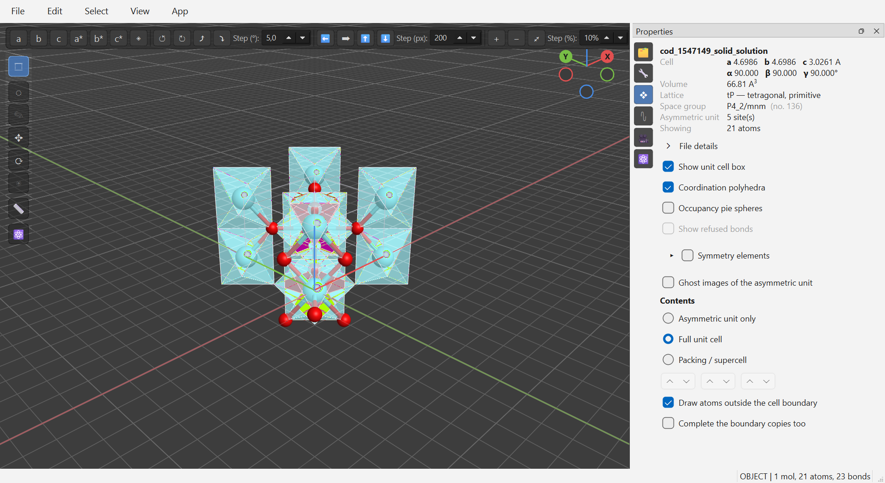
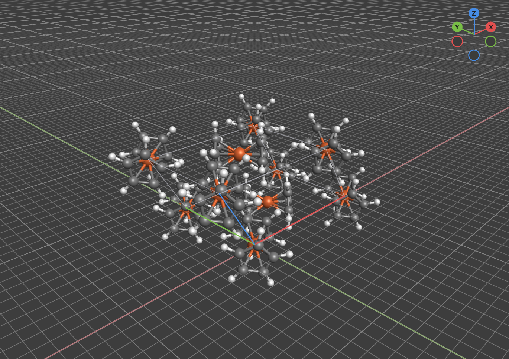
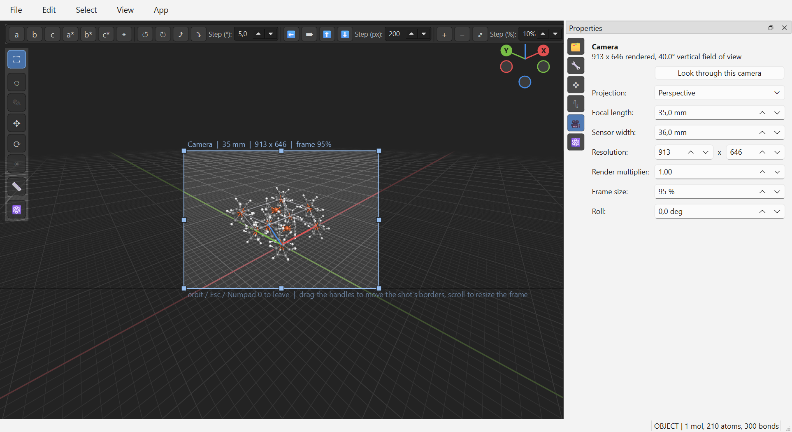
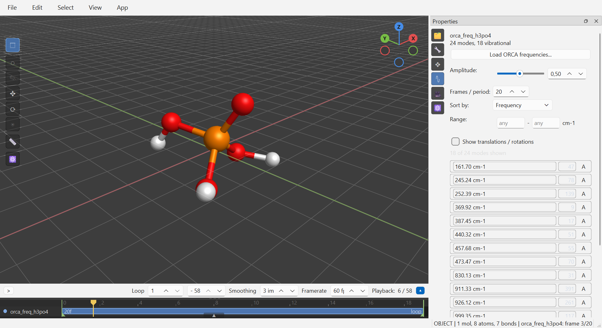

# Screenshots

Generated by `tools/screenshots.py` — do not edit by hand.

### 01-viewport

Ball-and-stick viewport with the scene outliner. Avogadro 2's element data and exact sizing rules; Blender's ergonomics around them.

### 02-crystal-polyhedra

CIF import that keeps the crystallography: space group and setting, symmetry operators, shared-site occupancies drawn as pie spheres, and closed coordination polyhedra with a VESTA-style specular sheen.

### 03-packing

A molecular crystal drawn as a crystal: molecules are wrapped by fragment and completed across the cell faces, never cut in half at a boundary.

### 04-camera-view

Camera objects ride the savefile. Looking through one really frames the shot: drag a border to reshape the film, Shift+drag to re-frame, the wheel to zoom the frame. F12 renders exactly this, and the Blender export carries the camera over.

### 05-vibrations

ORCA normal modes baked onto the scene clock, so a vibration plays, interpolates, sits on the multi-track timeline and exports through the same path as a trajectory.

